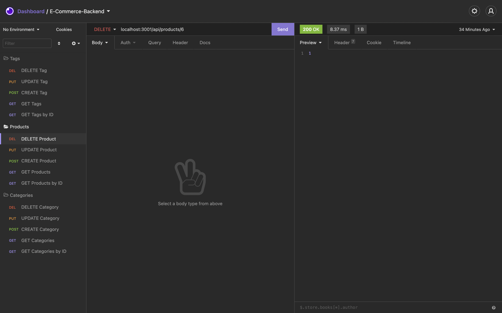

# E-Commerce Backend

## Description:
- For this task, I wanted to allow a manager to have a functional backend retail store made with latest technologies.  
- The reason I built this e-commerce backend was to understand the functionality of Express.js API and how a MySQL database can be incorporated.
- This task helped me gain a better understanding of the MySQL Sequelize, the Object Relational Mapper. I learned how to create models and extend those models to my API routes. I was also able to learn how to initialize a database in my command line as well as seed that database.

## How to run this application:
- E-Commerce is the backend of a platform that uses a database to run. In order to run this application, start off with ("npm install") to have npm and node modules.
- Before you continue, make sure you fill out the necessary information inside of the .env file.
- Once you install all dependencies, you will need to initiate the mysql database within the command line. To do this, first navigate to the db folder where the schema.sql file is stored ("cd db/"). Inside the db folder, you cna now initiate the database with ("mysql -v -u *DB_USER* -p < schema.sql"). You will be prompted to enter password, this is where you input your *DB_PASSSWORD*.
- After you have intiated a database, you will want to travel out of the db folder with a ("cd .."). Now we can seed the database with the seeds we have created in our repository with ("npm run seed").
- The final step is to start our server by running ("node server.js").

## Instuctional Video:
For a demonstration on how to run this application, please watch this video: [E-Commerce Walkthrough](https://www.youtube.com/watch?v=MZHyaY2Kth8)

## Intiating Database:

## Seeding the Database through the Command Line:

## Insomnia:
### Get All

### Get All By Primary Key

### Post 

### Put

### Delete
